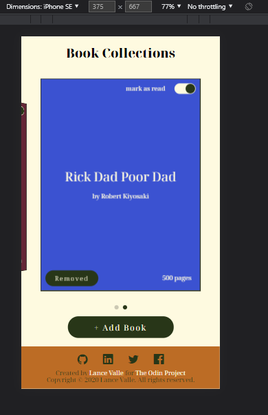

# Library (LocalStorage + swiper.js)

> ## From The Odin Project's [curriculum](https://www.theodinproject.com/courses/javascript/lessons/library)

> - [Live demo](https://lance28-beep.github.io/PROJECT-LIBRARY/) :shipit:

## Assignment

> Create a library where books are stored in localStorage
> experimental used of swiper.js and SCSS

## Acknowledgments

- localStorage [MDN](https://developer.mozilla.org/en-US/docs/Web/API/Web_Storage_API/Using_the_Web_Storage_API)
- Swiper.js [Swiper.js](https://swiperjs.com/swiper-api)
